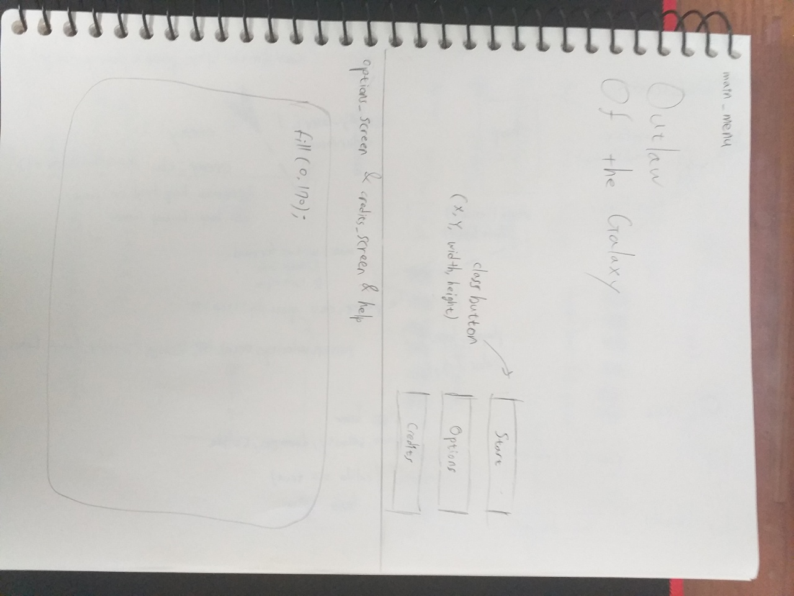
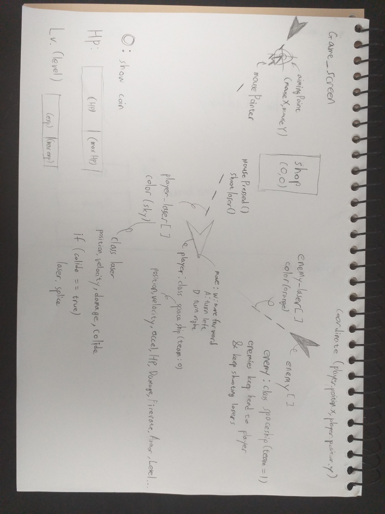
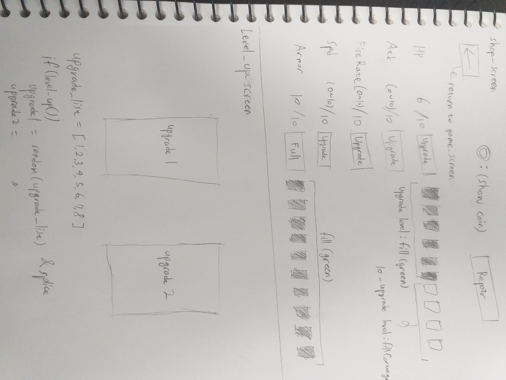

# Game Design

## High Concept
---

### Title : Outlaw of the Galaxy
It is top-view shooting game. In the outer space, player has to survive from surging enemies.

### Survive from Enemy's Attack!
You are running out from the cruel space empire, and spaceships from empire are keep chasing and trying to shoot you. You have to survive from those enemies' chase!

### Upgrade basic stats with your coin
You can get coins when you kill enemies chasing you. There's your Base at the center of map, and you can enter your base to upgrade your ship's health, attack damage, attack rate, armor, and move speed (up to 10 level each) by spend your coins. These helps you to survive more easily. And you can also repair your ship with coins in proportion to ship's damage rate.

### Level Up and Choose your Special Skills
By killing enemies, you can get not only coins but also experience point(exp) that allows you to level up. When level up, you can heal part of your hp for free as a reward. Also, there are total eight special skills that can add to your spaceship. Each time player's level goes up by 3 levels, player can choose one of two given skills(skills will be given randomly). There are some skills that simply upgrades your stat, or have a special gadgets that helps player to survive, or even makes player to kill enemies more easily!

## Theme
---
The given theme of project was "Take one, leave the rest." To 
fulfill this theme, I thought about "Level Up" function to give player to select options of upgrade. There are total eight special skills, and when moment to choose special skill comes, two options among them will be given randomly, and player could choose only one. If player choose one of them, player can't use rest of the skills until he or she restarts game.

## Mock Ups
---

## Main Menu

There are three buttons; Start, Options, and Credits. When clicking start button, screen passes to help screen which tells player simply about how to play it, and information about game elements. 

### Help screen
Help screen simply shows and tells about elements in the game. And it informs how to play this game.

### Options screen

### Credits screen
In credits screen, I just simply wrote contributors of this game (almost myself, but there's others who helped me to make this game, and I brought almost all of assets in website, so I wrote all of authors of them).

## Game screen

In the game screen, there's three noticeable user interfaces that shows some resources in this game: Health Point(HP), Coin, Level and Experience Point. Player can move spaceship with keyboard W,A and D; move forward with W, turn left and right with A and D. And you can shoot lasers and attack enemy's spaceships by pressing your mouse left button. Enemies keep spawning permanently if the number of enemy doesn't get over max limit of it. 

### Base screen (Shop screen)

In shop screen, you can upgrade your ship and repair your ship. When you kill enemies, you can get some coins. And with spending your coins, you can upgrade your upgrade

### Level Up screen
When player kills enemy and gain exp, player can level up when player get exp more than max exp. When level up, player get free HP heal for reward, and every time player gets level up three times, player could choose special skills(since I couldn't prepare that much upgrades, not every time, and only four times player could choose special skills). There are total 8 upgrades, and when moving to level up screen, game randomly prepare two options of special skills. When player choose one, player gets that special skill, and player couldn't use other skill until the game over and restarts.

### Special skills
There are total 8 kinds of special upgrades : 
1. Damage up : Increase player's attack damage up to 1.3X of its damage
2. Barrier : Deploy Barrier that defends enemy's attack, if getting attacked to enemy laser, barrier broke down after 2 seconds, and deploys again after 10 seconds
3. Missile turret : Player can blast missile with lasers every seconds, missile has 2X damage of laser's damage
4. Shock Wave : By pressing space key, player can use shock wave that deals nearby enemies. Shock wave has 3X damage of player's laser damage
5. Critical shot : Player's attack occasionally deals double damage to enemy (30%)
6. Heavy Armor : Gain more Armor, but become slower
7. Double HP : Double player's max HP
8. Guard Angel : Spawns guard angel that rotates around player, defends upcoming enemy lasers instead of player
